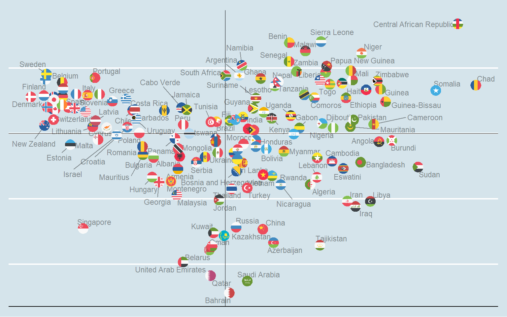
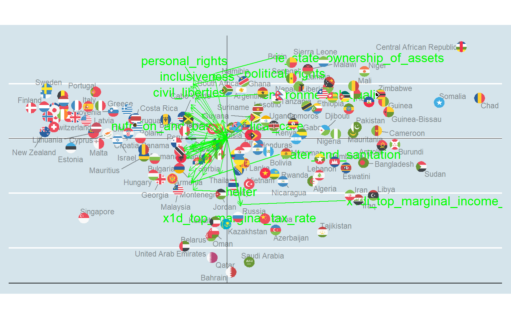
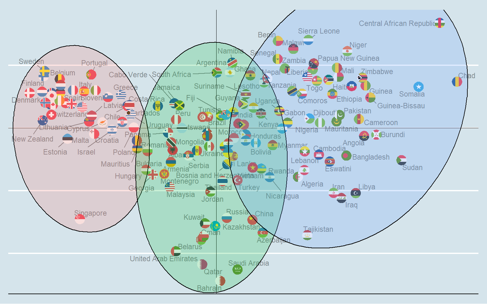

```{r setup, include=FALSE} 
knitr::opts_chunk$set(warning = FALSE, message = FALSE) 
```


# Summary








# Read in Data

```{r}
library(tidyverse)
library(ggplot2)
library(factoextra)
library(data.table)
library(caret)
library(ggflags)
```


```{r}
# Economic Index By Country
# Read in data
## Data from https://www.fraserinstitute.org/studies/economic-freedom
file_name = "economic-freedom-of-the-world-2022-dataset-by-country-tables.xlsx"
econ <- readxl::read_excel(file_name, sheet = "EFW Data 2022 Report")

# Clean column names
econ <- econ %>% janitor::row_to_names(row_number = 4) %>% 
  janitor::clean_names()

# Get most recent year foreach country
econ <- econ %>% group_by(iso_code_2) %>% arrange(desc(year)) %>% filter(row_number() == 1) %>% 
  mutate(countries = if_else(countries == "Russian Federation", "Russia", countries)) %>% 
  mutate(countries = if_else(countries == "Iran, Islamic Rep.", "Iran", countries))

# Get relevent columns
econ <- econ %>% select(1:5, 8, 10, 12, 14, 16, 18, 19, 20, 21, 22:31, 35, 37, 38, 39, 41, 45, 46, 47, 48, 49, 50:73)
```

```{r}
# Social Index by Country
## Data from https://en.wikipedia.org/wiki/Social_Progress_Index
social = read.csv("social_index_by_country_2021.csv")

social <- social %>% 
  janitor::clean_names() %>% 
  rename(countries = country) %>% 
  select(-spi_rank_14)
```

```{r}
# Internet Freedom Score by Country
## Data from https://freedomhouse.org/countries/freedom-net/scores

internet <- read.csv("internet_freedom_score.csv")

internet <- internet %>% janitor::clean_names() %>% 
  rename(countries = country_sort_descending) %>% 
  select(countries, obstacles_to_access, limits_on_content, violations_of_user_rights)
```

```{r}
# Freedom index by Country
## Data from https://freedomhouse.org/countries/freedom-world/scores

freedom <- read.csv("freedom_index_by_country.csv")

freedom <- freedom %>% janitor::clean_names() %>% 
  rename(countries = country_sort_descending) %>% 
  select(countries, political_rights, civil_liberties)
```


```{r}
# Merge all datasets

df <- econ %>% inner_join(social, by = "countries") %>% 
  #inner_join(internet, by = "countries") %>% 
  inner_join(freedom, by = "countries") %>% ungroup()

head(df)
```

```{r}
scaled_df <- df %>% 
  select(-c(year, iso_code_2, iso_code_3, countries)) %>%
  mutate_if(is.character, as.numeric) %>% 
  mutate_if(is.numeric, scale) %>% 
  # Drop columns with missing values
  select_if(~ !any(is.na(.)))

scaled_df <- data.frame(scaled_df)

rownames(scaled_df) <- df$countries

labels <- df %>% select(year, iso_code_2, iso_code_3, countries)
```

# PCA Graph + Code

```{r}
PCbiplot <- function(PC, x="PC1", y="PC2", with.arrows = TRUE) {
    # PC being a prcomp object
    data <- data.frame(obsnames=row.names(PC$x), PC$x)
    
    plot <- ggplot(data, aes_string(x=x, y=y)) + ggrepel::geom_text_repel(alpha=.4, size=3, aes(label=obsnames))
    
    plot <- plot + geom_hline(aes(yintercept=0), size=.2) + geom_vline(aes(xintercept=0), size=.2)
    
    datapc <- data.frame(varnames=rownames(PC$rotation), PC$rotation)
    mult <- min(
        (max(data[,y]) - min(data[,y])/(max(datapc[,y])-min(datapc[,y]))),
        (max(data[,x]) - min(data[,x])/(max(datapc[,x])-min(datapc[,x])))
        )
    datapc <- transform(datapc,
            v1 = .7 * mult * (get(x)),
            v2 = .7 * mult * (get(y))
            )
    
    if (with.arrows) {
      plot <- plot + coord_equal() + ggrepel::geom_text_repel(data=datapc, aes(x=v1, y=v2, label=varnames), size = 5, vjust=1, color="green")
    }
    
    plot <- plot + geom_flag(aes(country = tolower(labels$iso_code_2)))
    
    if (with.arrows) {
      plot <- plot + geom_segment(data=datapc, aes(x=0, y=0, xend=v1, yend=v2), arrow=arrow(length=unit(0.2,"cm")), alpha=0.75, color="green") 
    }
    
    plot <- plot + ggthemes::theme_economist() + theme(legend.position = "none",
                                          axis.ticks.x=element_blank(),
                                          axis.ticks.y=element_blank(),
                                          axis.text.x=element_blank(),
                                          axis.text.y=element_blank(),
                                          axis.title.x=element_blank(),
                                          axis.title.y=element_blank())
    plot
}
```

```{r}
# Run PCA
pca_result.1 <- prcomp(scaled_df, scale = FALSE)
```


```{r}
PCbiplot(pca_result.1, with.arrows = TRUE)
```

```{r}
PCbiplot(pca_result.1, with.arrows = FALSE)
```


# Clustering
```{r}
# Clustering on first two components of PCA
PCS <- data.frame(PC1 = pca_result.1$x[,1], PC2 = pca_result.1$x[,2])
```


## Determine Optimal Clusters

### Elbow Method
```{r}
# Elbow Method
fviz_nbclust(x = PCS, FUNcluster = kmeans, method = 'wss')
```


### Calinski-Harabasz index

```{r}
# [CHCriterion] : calculates both Calinski-Harabasz index and within sum squared error
# @kmax          = maximum cluster number, caculates the CH index from 2 cluster to kmax
# @clustermethod = "kmeanspp", "hclust"
Distance <- function(cluster)
{
  # the center of the cluster, mean of all the points
  center <- colMeans(cluster)
  
  # calculate the summed squared error between every point and 
  # the center of that cluster 
  distance <- apply( cluster, 1, function(row)
  {
    sum( ( row - center )^2 )
  }) %>% sum()
  
  return(distance)
}

Kmeanspp <- function( data, k, ... )
{
	# kmeans++, generating a better k initial random center for kmeans. Workflow:
	# 1. choose a data point at random from the dataset, this serves as the first center point. 
	# 2. compute the SQUARED distance of all other data points to the randomly chosen center point.
	# 3. to generate the next center point, each data point is chosen with the prob (weight) of 
	#    its squared distance to the chosen center of this round divided by the the 
	#    total squared distance (in R, sample function's probability are already weighted, 
	#    do not need to tune them to add up to one).
	# 4. next recompute the weight of each data point as the minimum of the distance between it and
	#    ALL the centers that are already generated ( e.g. for the second iteration, compare the 
	#    distance of the data point between the first and second center and choose the smaller one ).
	# 5. repeat step 3 and 4 until having k centers. 
	#
	# Parameters
	# ----------
	# data : data.frame, data.table, matrix data
	#
	# k : int 
	#     number of clusters
	# 
	# ... : 
	#     all other parameters that can be passed into R's kmeans except for the data and center
	#     , see ?kmeans for more detail
	#
	# Returns
	# -------
	# result : list
	#     R's kmeans original output
	#
	# Reference
	# ---------
	# https://datasciencelab.wordpress.com/2014/01/15/improved-seeding-for-clustering-with-k-means/

	if( !is.data.table(data) )
		data <- data.table(data)
	
	# used with bootstrapped data. so unique the data
	# to avoid duplicates, or kmeans will warn about 
	# identical cluster center
	unique_data <- unique(data)

	# generate the first center randomly
	n <- nrow(unique_data)
	center_ids <- integer(k)
	center_ids[1] <- sample.int( n, 1 )

	for( i in 1:( k - 1 ) ){		
		
		# calculate the squared distance between the center and 
		# all the data points
		center <- unique_data[ center_ids[i], ]
		dists <- apply( unique_data, 1, function(datapoint){
			sum( ( datapoint - center )^2 )
		})

		# sample the next center using the squared distance as the weighted probability,
		# starting from the second center, the measure "squared distance" for each data point
		# is the min distance between each data point and each center that has already been
		# generated
		if( i == 1 ){		
			distance <- dists
		}else{
			distance <- cbind( distance, dists )
			distance <- apply( distance, 1, min )
		}
		center_ids[ i + 1 ] <- sample.int( n, 1, prob = distance )					
	}

	# cluster the whole "data", using the center_ids generated using kmeanspp
	results <- kmeans( data, centers = unique_data[ center_ids, ], ... )
	return(results)	
}
## method 2 : Calinski-Harabasz index, ratio of the between cluster variance
#			  to the total within cluster variance
# http://www.mathworks.com/help/stats/clustering.evaluation.calinskiharabaszevaluation-class.html 

# TSS (total sum of square) : the squared distance of all the data points from 
# the dataset's centroid 

# BSS (between sum of square) = TSS - WSS, measures how far apart are the clusters
# from each other 
# !! a good clustering has a small WSS and a high BSS

# CHIndex = B / W, the ratio should be maximized at the optimal k
# B = BSS(k) / (k-1) ; k = # of cluster
# W = WSS(k) / (n-k) ; n = # of data points

# [CHCriterion] : calculates both Calinski-Harabasz index and within sum squared error
# @kmax          = maximum cluster number, caculates the CH index from 2 cluster to kmax
# @clustermethod = "kmeanspp", "hclust"

CHCriterion <- function( data, kmax, clustermethod, ...  )
{
  if( !clustermethod %in% c( "kmeanspp", "hclust" ) )
    stop( "method must be one of 'kmeanspp' or 'hclust'" )
  
  # total sum squared error (independent with the number of cluster k)
  tss <- Distance( cluster = data )
  
  # initialize a numeric vector storing the score
  wss <- numeric(kmax)
  
  # k starts from 2, cluster 1 is meaningless
  if( clustermethod == "kmeanspp" )
  {
    for( k in 2:kmax )
    {
      results <- Kmeanspp( data, k, ... )
      wss[k]  <- results$tot.withinss 
    }		
  }else # "hclust"
  {
    d <- dist( data, method = "euclidean" )
    clustering <- hclust( d, ... )
    for( k in 2:kmax )
    {
      groups <- cutree( clustering, k )
      wss[k] <- WSS( data = data, groups =  groups )
    }
  }		
  
  # between sum of square
  bss <- tss - wss[-1]
  
  # cluster count start from 2! 
  numerator <- bss / ( 1:(kmax-1) )
  denominator <- wss[-1] / ( nrow(data) - 2:kmax )
  
  criteria <- data.frame( k = 2:kmax,
                          CHIndex = numerator / denominator,
                          wss = wss[-1] )
  
  # convert to long format for plotting 
  criteria_long <- gather( criteria, "index", "value", -1 )
  
  plot <- ggplot( criteria_long, aes( k, value, color = index ) ) + 
    geom_line() + geom_point( aes( shape = index ), size = 3 ) +
    facet_wrap( ~ index, scale = "free_y" ) + 
    guides( color = FALSE, shape = FALSE )
  
  return( list( data = criteria, 
                plot = plot ) )
}

criteria <- CHCriterion( data = PCS, kmax = 10, clustermethod = "kmeanspp", nstart = 10, iter.max = 100 )

criteria
```


## K-means
```{r}
# Optimal is about 3 clusters
set.seed(5)
km <- kmeans(PCS, 3) # 3 clusters

clust <- data.frame(km$cluster) %>% 
  mutate(countries = rownames(.)) %>% 
  rename(cluster = km.cluster)

pcs <- data.frame(pca_result.1$x) %>% 
  mutate(countries = rownames(.))

d <- clust %>% inner_join(pcs, by = "countries") %>% 
  mutate(cluster = as.factor(cluster))

PCbiplot(pca_result.1, with.arrows = FALSE) +
  ggforce::geom_mark_ellipse(data = d, aes(x = PC1, y = PC2, fill = cluster), alpha = 0.2)
```

